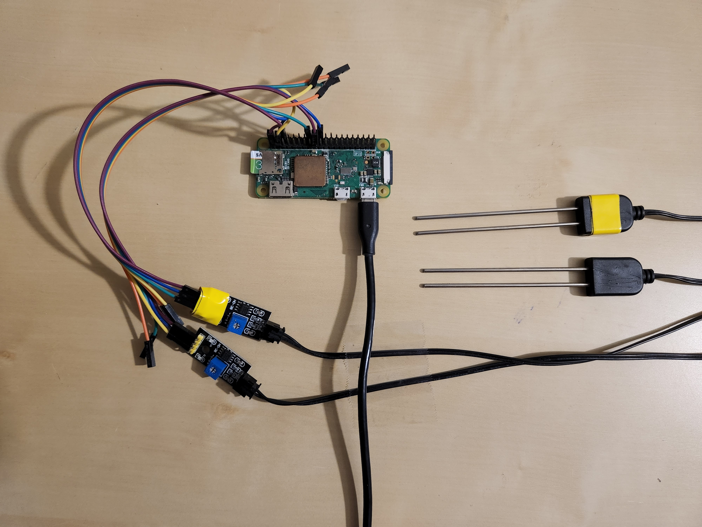
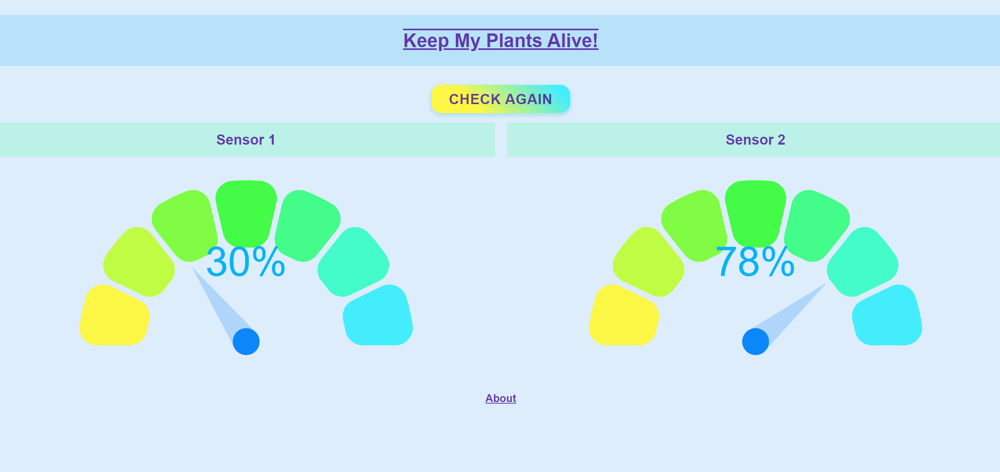

# Keep My Plants Alive!

## About

This full-stack system monitors soil moisture levels in houseplants. Data from moisture sensors is retrieved from an Express API and a React app displays the moisture readings. Both run on a raspberry pi.

The sensors can be put in water or soil and the moisture percentage readings will be displayed on gauges on the webpage.

 Thank you for checking out my project :) 

   

     Credits
  

  
###### Thanks to [Martin36](https://github.com/Martin36) for the [react component](https://github.com/Martin36/react-gauge-chart) that helped me create this app.

