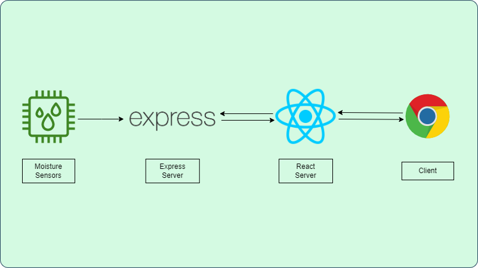

# Keep My Plants Alive!

[](https://www.gnu.org/licenses/agpl-3.0)

## About


Keep My Plants Alive is a comprehensive system designed to help you maintain the health and hydration of your houseplants. It leverages the power of moisture sensors, an Express API, and a React app, all running on a Raspberry Pi.


The moisture sensors can be placed in freshly-watered or dry soil, and they transmit data to the Express API. This data is then visualized on user-friendly gauges in the React app.



With Keep My Plants Alive, you can ensure your plants are neither over-watered nor under-watered!


## Usage

To use Keep My Plants Alive, follow these steps:

1. Clone or Download the Repository:
```
git clone https://github.com/your-username/keep-my-plants-alive
````
or download the zip file of this repository to your local system.

2. Install Dependencies: Navigate to the project directory and install dependencies from the package.json file with
```
cd keep-my-plants-alive && npm i
````

3. Set Up the Hardware: Connect the moisture sensors to your Raspberry Pi. Make sure the connections are secure and correct.

4. Run the Express API: Navigate to its directory and start the API with
```
cd express-api && npm start
````
If the server started successfully, you should see a confirmation message in the console.

5. Run the React App: Navigate to its directory and start the React app with
```
cd react-app && npm start
````
The app should open in your default web browser.

6. Use the App: Click the "Check again" button in the app to fetch the latest sensor data. The gauges should update to reflect the current moisture levels.

## Troubleshooting

If you run into any issues while using Keep My Plants Alive, consider the following solutions:

- Check the Sensor Connections: Ensure that the moisture sensors are correctly and securely connected to the Raspberry Pi GPIO pins 2 and 23. If the sensors are not connected properly, the API will not be able to read accurate data.
- Verify the API Status: Make sure the Express API is running without errors. You can check this by looking at the console output. If the server started successfully, you should see a confirmation message. If you don't see this message or if you see any error messages, there may be an issue with the server.
- Recalibrate the Sensors: If the gauges in the React app are not showing accurate readings, the sensors may need to be recalibrated. Check the documentation for your specific sensors to see how to do this.
- Check the Sensor State: If the gauges in the React app are always showing that the soil is dry, even when it's wet, it could be because the readSync() method is returning 1 when the sensor is wet and 0 when it's dry, which is the opposite of what the API expects. Try removing the ! operator in the /sensor endpoint to invert the values.

## Credits

Keep My Plants Alive was developed by [spaceC00kie](https://github.com/spaceC00kie). Thanks to [Martin36](https://github.com/Martin36) for the [React component](https://github.com/Martin36/react-gauge-chart) that helped make this app possible.
