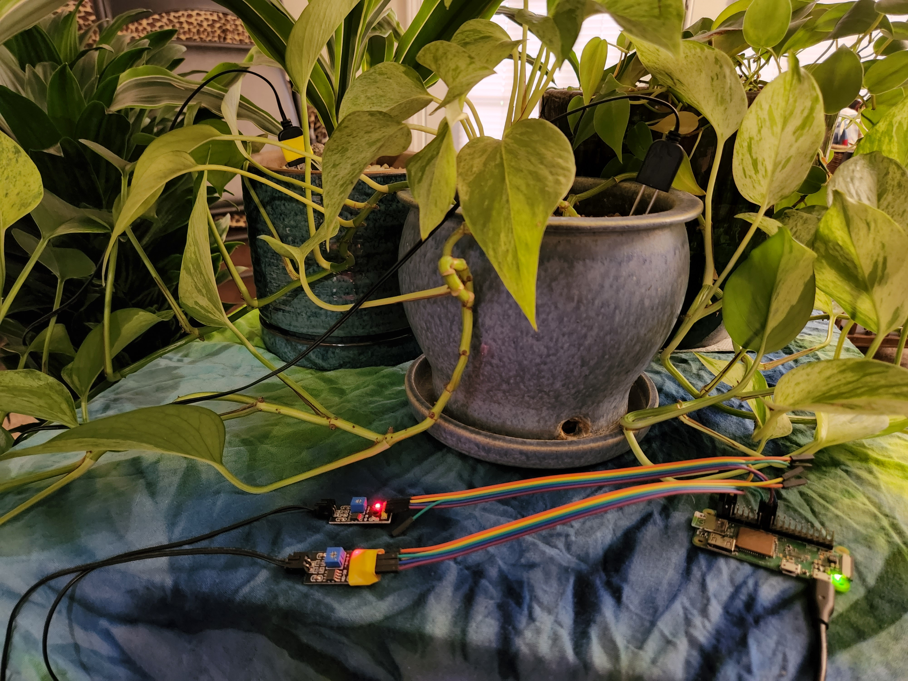

# Keep My Plants Alive!

## About

Do you struggle to keep your houseplants healthy and hydrated? Introducing Keep My Plants Alive, a full-stack system that makes it easy to monitor soil moisture levels in your plants.

Our system features moisture sensors that can be placed in water or soil. The sensors send readings to an Express API, which then displays the data on easy-to-read gauges in a React app. And the best part? It all runs on a convenient raspberry pi.

With Keep My Plants Alive, you'll never have to worry about over- or under-watering your plants again!

## Usage

To use Keep My Plants Alive, simply clone or download this repository

## Credits

Keep My Plants Alive was created by me, spaceC00kie. Thanks to [Martin36](https://github.com/Martin36) for the [React component](https://github.com/Martin36/react-gauge-chart) that helped make this app possible.

## License
This project is licensed under the MIT License. See the LICENSE file for more details.
